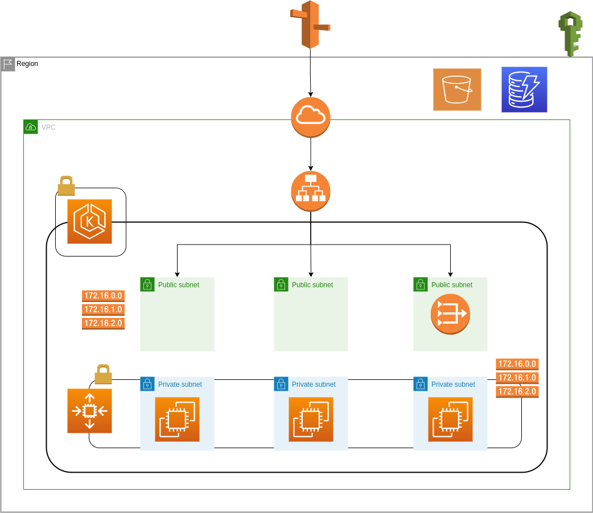
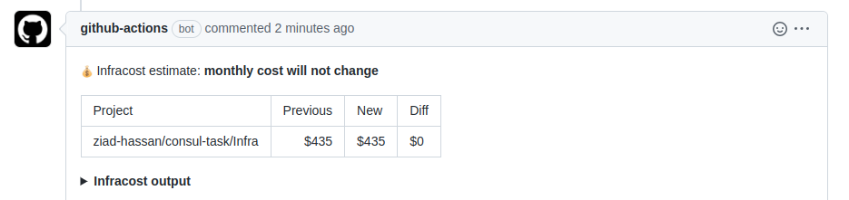
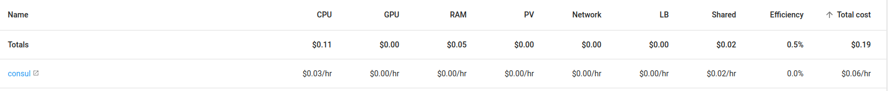

# Task
## Case:
  - Deploy a HA Consul cluster distributed over at least 3 availability zones on AWS Cloud
## Acceptance Critiria:
  - Fully automated deployment and maintenance
  - HA cluster distributed over at least 3 availability zones
  - Deployed on AWS cloud
  - Consul instances should discover themselves using DNS
  - Cost estimate
# Solution:
- There are 3 different possible approaches as per the below table:

| **<br>**                    | **HCP**                                                                                                                                                                                                                    | **Kubernetes**                                                                | **Virtual Machines**                                |
| --------------------------- | -------------------------------------------------------------------------------------------------------------------------------------------------------------------------------------------------------------------------- | ----------------------------------------------------------------------------- | --------------------------------------------------- |
| **Deployment tool**         | Terraform                                                                                                                                                                                                                  | Terraform and Helm                                                            | Terraform and Bash                                  |
| **Deployment Architecture** | Fully Automated deployment where:<br>\- Servers are deployed in an HVN using terraform on aws (EKS, ECS or EC2 )<br>\- Client is deployed on customer’s VPC<br>\- Peering is established between Consul HVN and Client VPC | Fully Automated Deployment Using a Helm Chart to deploy all Consul components | Fully Automated deployment using Terraform and Bash |
| **Deployment Overhead**     | Low                                                                                                                                                                                                                        | Low to Moderate                                                               | High                                                |
| **Platform**                | AWS or Azure                                                                                                                                                                                                               | Any K8s Cluster                                                               | Any Virtual Machine                                 |
| **Efficiency**              | High (but costy)                                                                                                                                                                                                           | Very High                                                                     | Low                                                 |
| **Scalability**             | High (but costy)                                                                                                                                                                                                           | Very High                                                                     | Low                                                 |
| **Maintenance Overhead**    | Very Low                                                                                                                                                                                                                   | High                                                                          | Very High                                           |
| **DNS discovery**           | Automatically Configured                                                                                                                                                                                                   | Configurable                                                                  | Configurable                                        |
| **Cost**                    | Highest specially on scaling<br>starting at $0.027/hr for up to 50 service instances                                                                                                                                       | Low to Moderate                                                               | High                                                |
| **Recommendation**          | For small environments and ease of mind                                                                                                                                                                                    | For large environments where K8s cluster already exists                       | Not Recommended                                     |

## <ins>**Based on the above i chose the kubernetes option to demonestrate my experience in terraform, helm and other devops tools.**</ins>

## Architecture:
- **Terraform Backend:**
  - S3
  - DynamoDB
- **Networking:**
  - VPC with 3 private subnets and 3 public subnets
  - IGW, Nat gateway, Routing tables/rules 
  - NLB for Ingress (automatically generated by ingress)
- **EKS:**
  - Private EKS Cluster in the 3 private subnets
  - EKS OIDC provider, addons (coredns, kubeproxy, ebs-csi-driver, CNI)
  - Roles and SGs
- **Helm:**
  - Karpenter Autoscaler
  - Ingress Controller
  - Kubecost for cost recommendations
  - Consul:
    - stateful set with pod antiaffinity to spread the pods on different (subnets) AZs
    - Injection enabled
    - Ingress for the UI  

  

- ### Achievments from this architecture:
  - **Reliablity:**
    - HA of kubernetes itself
    - HA of consul using Podantiaffinity to distribute the pods on 3 different nodes
    - Persistence storage can be configured
  - **Scalability:**
    - Karpenter intelligent autoscaler
    - Consul STS where the number of replicas can be increased at anytime
  - **Security:**
    - Private Kubernetes cluster with egress access to the internet
    - Granual security by using OIDC for per pod access to AWS resources
    - Consul gossip encryption
  - **Observability and Cost:**
    - **Kubecost** will give recommendation of the cost for us to tune
    - **infracost:** is configured on terraform git repo to give cost estimates on PRs

# Procedure
- ## Prerequisites:
  - Install awscli
  - Configure awscli with a profile
  - Install terraform
  - Install helm
  - replace values in variables.tfvars files on backend and infra
- ## Provision Infrastructure
    ```bash
    # Provision S3 & DynamoDB for terraform backend
    cd ./Backend
    AWS_PROFILE=test-terraform terraform init
    AWS_PROFILE=test-terraform terraform validate
    AWS_PROFILE=test-terraform terraform plan -var-file variables.tfvars
    AWS_PROFILE=test-terraform terraform apply -var-file variables.tfvars -auto-approve
    # Provision Infrastructure
    cd ./Infra
    AWS_PROFILE=test-terraform terraform init
    AWS_PROFILE=test-terraform terraform validate
    AWS_PROFILE=test-terraform terraform plan -var-file variables.tfvars
    AWS_PROFILE=test-terraform terraform apply -var-file variables.tfvars -auto-approve
    ```
- ## Connect to the cluster:
  ```bash
  aws eks --region us-west-2 update-kubeconfig --name test-cluster --profile test-terraform
  ```
- ## Testing:
  - ### Karpenter
    ```bash
    # Test Karpenter
    cat <<EOF | kubectl apply -f -
    apiVersion: v1
    kind: Pod
    metadata:
      name: mypod
    spec:
      containers:
      - name: app
        image: nginx
        resources:
          requests:
            cpu: "8"
    EOF
    watch "kubectl get po; kubectl get nodes"
    kubectl delete pod mypod # Make sure that the pod and The node were deleted as this may incur very high cost
    ```
  - ### Ingress and Kubecost
    ```bash
    # Test Ingress and Kubecost
    ## Navigate for the below URL for the dashboard
    kubectl port-forward  svc/kubecost-cost-analyzer -n kubecost 9090
    echo http://localhost:9090/overview.html
    ```
  - ### Consul
    ```bash
    # Test Consul UI
    URL=`kubectl get ingress -n consul consul-ui -o jsonpath="{.status.loadBalancer.ingress[0].hostname}"`
    echo http://`echo $URL`
    ```
    ```bash
    # Test Service Mesh and intentions
    # Server
    cat <<EOF | kubectl apply -f -
    apiVersion: v1
    kind: Service
    metadata:
      # This name will be the service name in Consul.
      name: static-server
    spec:
      selector:
        app: static-server
      ports:
        - protocol: TCP
          port: 80
          targetPort: 8080
    ---
    apiVersion: v1
    kind: ServiceAccount
    metadata:
      name: static-server
    ---
    apiVersion: apps/v1
    kind: Deployment
    metadata:
      name: static-server
    spec:
      replicas: 1
      selector:
        matchLabels:
          app: static-server
      template:
        metadata:
          name: static-server
          labels:
            app: static-server
          annotations:
            'consul.hashicorp.com/connect-inject': 'true'
        spec:
          containers:
            - name: static-server
              image: hashicorp/http-echo:latest
              args:
                - -text="hello world"
                - -listen=:8080
              ports:
                - containerPort: 8080
                  name: http
          # If ACLs are enabled, the serviceAccountName must match the Consul service name.
          serviceAccountName: static-server
    EOF

    # Client
    cat <<EOF | kubectl apply -f -
    apiVersion: v1
    kind: Service
    metadata:
      # This name will be the service name in Consul.
      name: static-client
    spec:
      selector:
        app: static-client
      ports:
        - port: 80
    ---
    apiVersion: v1
    kind: ServiceAccount
    metadata:
      name: static-client
    ---
    apiVersion: apps/v1
    kind: Deployment
    metadata:
      name: static-client
    spec:
      replicas: 1
      selector:
        matchLabels:
          app: static-client
      template:
        metadata:
          name: static-client
          labels:
            app: static-client
          annotations:
            'consul.hashicorp.com/connect-inject': 'true'
        spec:
          containers:
            - name: static-client
              image: curlimages/curl:latest
              # Just spin & wait forever, we'll use `kubectl exec` to demo
              command: ['/bin/sh', '-c', '--']
              args: ['while true; do sleep 30; done;']
          # If ACLs are enabled, the serviceAccountName must match the Consul service name.
          serviceAccountName: static-client
    EOF

    # Test Connectivity Using UI or curl:
    kubectl exec deploy/static-client -c static-client -- curl --silent http://static-server/

    # Apply a deny Intension from the UI then test again
    kubectl exec deploy/static-client -c static-client -- curl --silent http://static-server/

    # Cleaning
    kubectl delete deploy static-server static-client
    ```
- ## Destroy the Infrastructure:
  ```bash
  # Destroy Infrastructure
  cd ./Infra
  AWS_PROFILE=test-terraform terraform destroy -var-file variables.tfvars -auto-approve
  # Destroy backend resources
  cd ./Backend
  # Delete the objects on S3 bucket using python boto script or from AWS console as versioning is enabled
  AWS_PROFILE=test-terraform terraform destroy -var-file variables.tfvars -auto-approve
  # Manually delete dynamically provisioned ebs volumes for helm charts from AWS console
  ```
- ## Durations:
  - **Provisioning Duration:** 30 minutes
  - **Destruction Duration:** 24 minutes
- ## Cost:
  - **EKS:** using 3 nodes of t3a.xlarge => 435/24/30 ~= **$0.6/h**
      
  - **Consul only estimate:** HA, and unlimited services = **$0.06/h**
      
  - **HCP**: single server, dev plan, 50 services = **$0.027/h**

# Enhancements:
- ## Developer Experience:
  - Helm Charts can be saved to a private Helm Repo
  - CI tool like (**circleci, jenkins, github actions**) can be used to build and push HELM charts or run Terraform
  - CD/Gitops tool like (**FluxCD**) can be used to manage deployment of charts to the environment
- ## Security:
  - **Secret Manager** and **External-Secrets** can be used for secret management
  - **AWS ACM** or **Cert-Manager** can be used to provide certificates
  - **grype** for CI security scanning
  - Consul ACL
  - Consul service to service encrypted communication (mtls)
- ## Observability and cost:
  - **Promethus** , **Alert Manager** and **Grafana** can be used for monitoring, Alerting and visualization
  - **ELK** can be used for centralized logging
- ## Others:
  - **Route53** hosted zone can be configured for Ingress NLB
